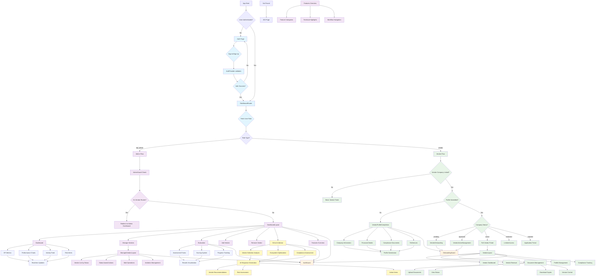

# VendorPro Application Flow Diagram

This comprehensive diagram shows the complete flow of the VendorPro application, including authentication, role-based routing, user workflows, and AI-powered features.

## Flow Description

### Authentication Flow (Light Blue)
- Initial authentication check and login/signup process
- Role determination and routing setup
- Session management and token refresh

### Admin Flow (Light Purple)
- BPI Admin dashboard with comprehensive analytics
- Vendor management with status-based organization
- Access to evaluation, vendor addition/removal
- Echo AI Advisor for intelligent decision making
- Features overview and system navigation

### Vendor Flow (Light Green)  
- Multi-stage vendor onboarding process
- Status-dependent access levels and capabilities
- Profile completion and renewal workflows
- Document management and compliance tracking
- Self-service portal with dashboard overview

### Guard Flow (Light Orange)
- Authentication and authorization checks
- Route protection and access control
- Role-based permission enforcement

### AI Flow (Light Yellow)
- Echo AI Advisor with three analysis types
- Intelligent vendor selection recommendations
- Ecosystem optimization suggestions
- Compliance assessment and risk analysis

### Dashboard Flow (Light Blue)
- Real-time KPI metrics and performance tracking
- Interactive charts and data visualization
- Activity feeds and notification management
- Risk alerts and compliance monitoring

## Key Components

### Security & Access Control
- **AuthGuard**: Protects all authenticated routes
- **AdminGuard**: Ensures admin-only access to management functions
- **OnboardingGuard**: Controls vendor progression through onboarding stages
- **RoleBasedRouter**: Handles role-specific routing logic

### Admin Components
- **DashboardLayout**: Main admin interface with sidebar navigation
- **ManageVendorsLayout**: Specialized vendor management interface
- **Echo AI Advisor**: AI-powered analysis and recommendation engine
- **Evaluation System**: Structured vendor assessment framework

### Vendor Components
- **VendorLayout**: Vendor-specific interface with responsive design
- **VendorProfileCompletion**: Multi-step profile completion process
- **VendorOnboarding**: Guided onboarding workflow
- **VendorActiveManagement**: Active vendor management portal

### Data & Analytics
- **Dashboard Analytics**: Real-time metrics and performance tracking
- **Performance Charts**: Interactive data visualization
- **Activity Monitoring**: Live activity feeds and event tracking
- **Risk Assessment**: Automated risk scoring and alerts

## Workflow Stages

### Vendor Onboarding Stages
1. **Application Submission**: Initial vendor application with basic information
2. **Profile Completion**: Detailed company, financial, and compliance information
3. **Document Upload**: Required certifications and supporting documents
4. **Admin Review**: BPI administrator evaluation and approval process
5. **Onboarding**: Final setup and system access configuration
6. **Active Management**: Ongoing vendor relationship management

### Admin Management Workflow
1. **Dashboard Overview**: Monitor key metrics and vendor status
2. **Vendor Evaluation**: Review and assess vendor applications
3. **AI-Assisted Analysis**: Use Echo AI for intelligent recommendations
4. **Decision Making**: Approve, reject, or request additional information
5. **Ongoing Management**: Monitor performance and compliance
6. **Renewal Processing**: Handle contract renewals and updates

## Technical Architecture

### Frontend Components
- **React Router**: Client-side routing with nested layouts
- **Context Providers**: Global state management for auth and theme
- **Protected Routes**: Route-level access control and guards
- **Responsive Design**: Mobile-first design with adaptive layouts

### Backend Integration
- **Supabase Auth**: Secure authentication with JWT tokens
- **Real-time Database**: Live data synchronization across clients
- **Row Level Security**: Database-level access control
- **File Storage**: Secure document upload and management

### AI Integration
- **Natural Language Processing**: Query interpretation and analysis
- **Machine Learning**: Vendor matching and recommendation algorithms
- **Risk Assessment**: Automated compliance and performance evaluation
- **Predictive Analytics**: Future performance and risk prediction