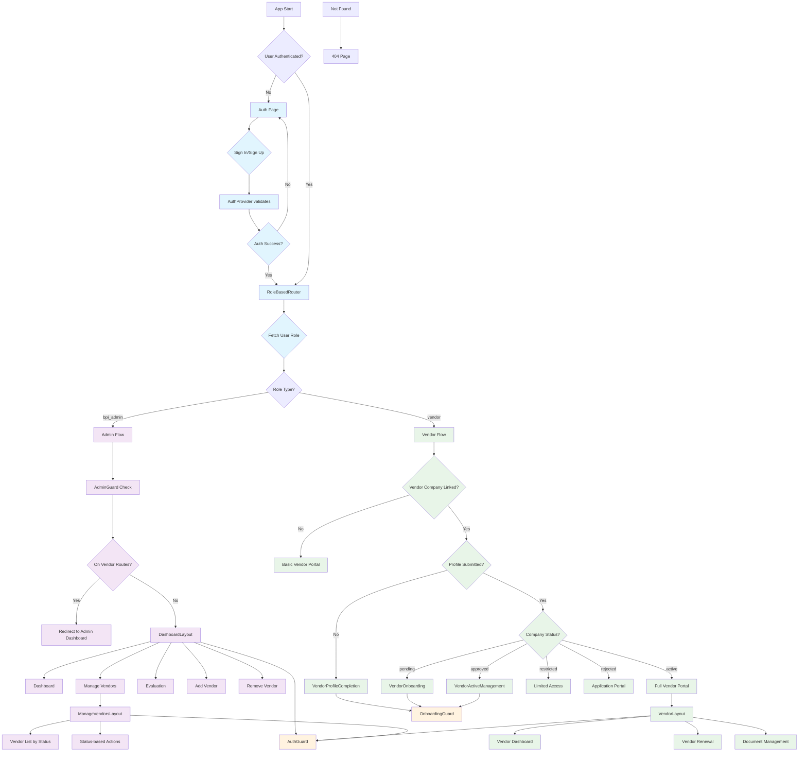

# VendorPro Application Flow Diagram

This diagram shows the complete flow of the VendorPro application, including authentication, role-based routing, and user workflows.

## Flow Description

### Authentication Flow (Light Blue)
- Initial authentication check and login/signup process
- Role determination and routing setup

### Admin Flow (Light Purple)
- BPI Admin dashboard and vendor management
- Access to evaluation, vendor addition/removal
- Status-based vendor organization

### Vendor Flow (Light Green)  
- Multi-stage vendor onboarding process
- Status-dependent access levels
- Profile completion and renewal workflows

### Guard Flow (Light Orange)
- Authentication and authorization checks
- Route protection and access control

## Key Components

- **AuthGuard**: Protects authenticated routes
- **AdminGuard**: Ensures admin-only access
- **OnboardingGuard**: Controls vendor onboarding flow
- **RoleBasedRouter**: Handles role-specific routing logic